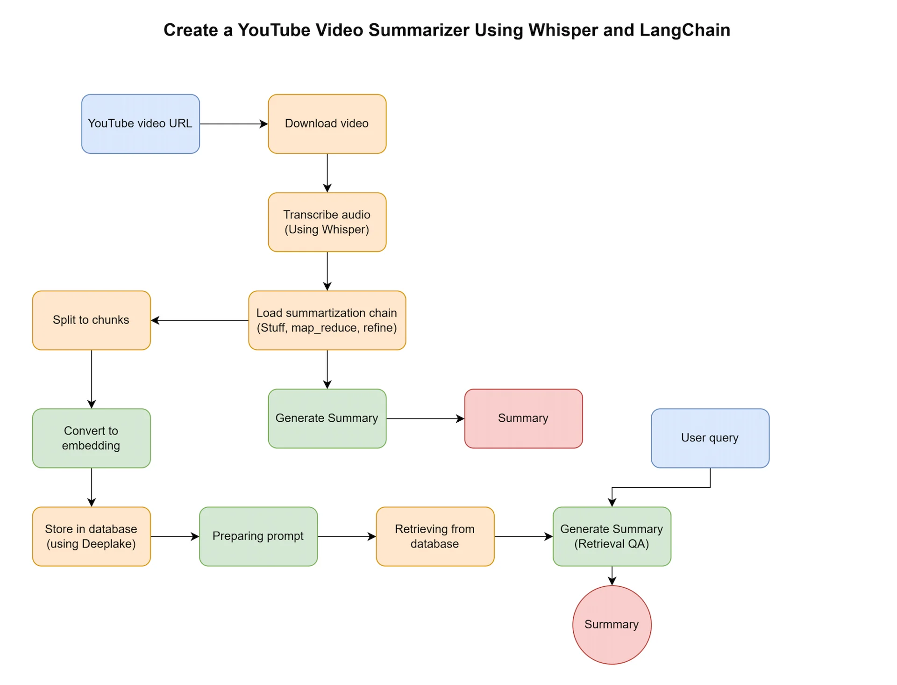

# youtube_summarizer

Workflow:

- Download the YouTube audio file.
- Transcribe the audio using Whisper.
- Summarize the transcribed text using LangChain with three different approaches: stuff, refine, and map_reduce.
- Adding multiple URLs to DeepLake database, and retrieving information. 

